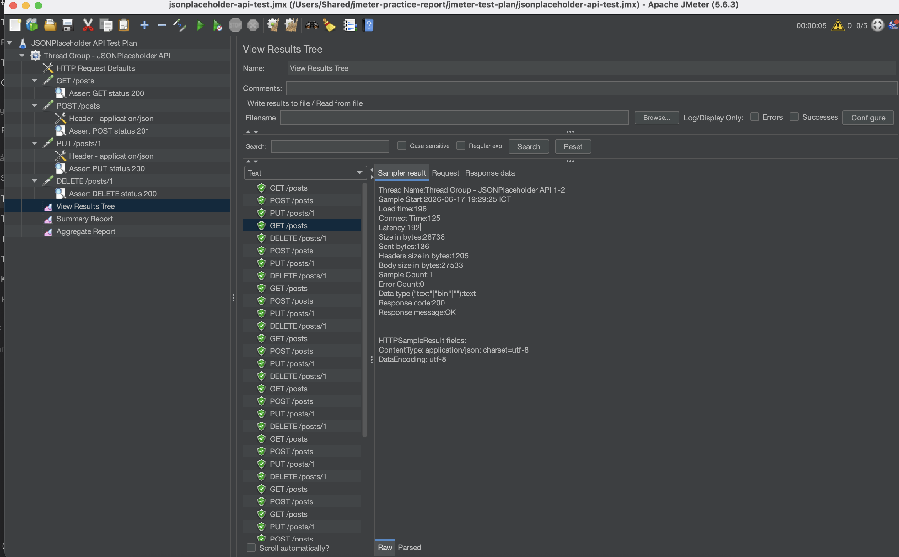
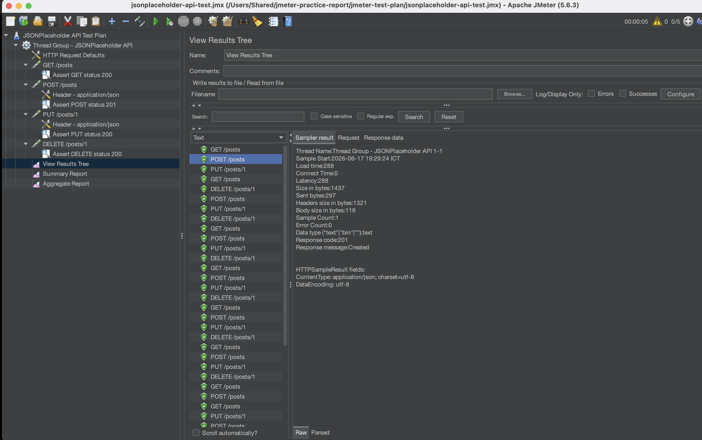
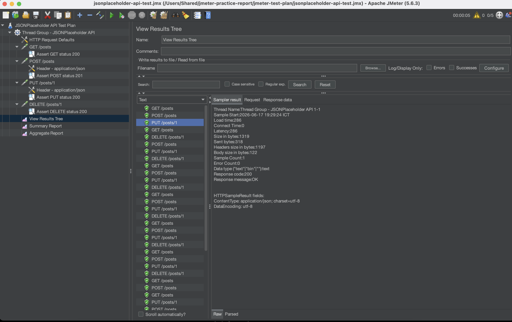
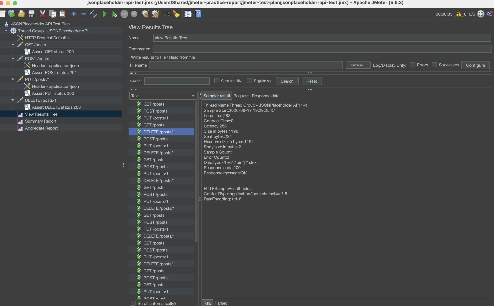

# Báo cáo thực hành kiểm thử API bằng Apache JMeter

## Mục lục

- [Giới thiệu Apache JMeter](#giới-thiệu-apache-jmeter)
- [Mục tiêu bài thực hành](#mục-tiêu-bài-thực-hành)
- [API dùng để kiểm thử](#api-dùng-để-kiểm-thử)
- [Cấu trúc project](#cấu-trúc-project)
- [Mô tả các request kiểm thử](#mô-tả-các-request-kiểm-thử)
- [Cách mở và chạy test plan](#cách-mở-và-chạy-test-plan)
- [Kết quả mong đợi](#kết-quả-mong-đợi)
- [Ảnh minh họa kết quả](#ảnh-minh-họa-kết-quả)
- [Kết luận](#kết-luận)

## Giới thiệu Apache JMeter

Apache JMeter là công cụ mã nguồn mở dùng để kiểm thử hiệu năng, kiểm thử tải và kiểm thử chức năng cho nhiều loại hệ thống khác nhau. JMeter thường được sử dụng để kiểm thử Web API, website, cơ sở dữ liệu, FTP server và các dịch vụ mạng.

Trong bài thực hành này, JMeter được dùng để gửi các request HTTP đến một API public, sau đó quan sát mã trạng thái phản hồi, thời gian phản hồi và thống kê kết quả bằng các Listener có sẵn trong JMeter.

## Mục tiêu bài thực hành

Bài thực hành nhằm giúp sinh viên:

- Làm quen với giao diện và cấu trúc Test Plan trong Apache JMeter.
- Tạo Thread Group đơn giản để mô phỏng nhiều người dùng gửi request.
- Kiểm thử các phương thức HTTP phổ biến: `GET`, `POST`, `PUT`, `DELETE`.
- Cấu hình request body dạng JSON và header `Content-Type: application/json`.
- Sử dụng Listener để xem chi tiết và tổng hợp kết quả chạy kiểm thử.

## API dùng để kiểm thử

API được sử dụng trong bài là JSONPlaceholder:

```text
https://jsonplaceholder.typicode.com
```

JSONPlaceholder là API public dùng cho mục đích demo, học tập và kiểm thử. Dữ liệu trả về không được lưu thật trên server đối với các request thêm, sửa, xóa, nhưng API vẫn trả về response phù hợp để phục vụ việc thực hành.

## Cấu trúc project

```text
jmeter-practice-report/
├── README.md
├── jmeter-test-plan/
│   └── jsonplaceholder-api-test.jmx
├── screenshots/
│   ├── get-result.png
│   ├── post-result.png
│   ├── put-result.png
│   └── delete-result.png
└── .gitignore
```

Trong đó:

| Thành phần | Mô tả |
|---|---|
| `README.md` | File báo cáo hướng dẫn và mô tả bài thực hành |
| `jmeter-test-plan/jsonplaceholder-api-test.jmx` | File Test Plan mở bằng Apache JMeter |
| `screenshots/` | Thư mục chứa ảnh minh họa kết quả chạy test |
| `.gitignore` | File loại trừ các file tạm, log và kết quả chạy không cần push |

## Mô tả các request kiểm thử

Test Plan gồm 4 request chính tương ứng với 4 phương thức HTTP thường dùng khi kiểm thử REST API.

| STT | Tên request trong JMeter | Phương thức | Endpoint | Mục đích |
|---:|---|---|---|---|
| 1 | `GET /posts` | `GET` | `/posts` | Lấy danh sách bài viết |
| 2 | `POST /posts` | `POST` | `/posts` | Tạo mới một bài viết demo |
| 3 | `PUT /posts/1` | `PUT` | `/posts/1` | Cập nhật bài viết có ID bằng 1 |
| 4 | `DELETE /posts/1` | `DELETE` | `/posts/1` | Xóa bài viết có ID bằng 1 |

### Cấu hình Thread Group

Thread Group trong file `.jmx` được cấu hình như sau:

| Thuộc tính | Giá trị |
|---|---:|
| Number of Threads | 5 |
| Ramp-up Period | 5 seconds |
| Loop Count | 1 |

Ý nghĩa: JMeter sẽ mô phỏng 5 người dùng, khởi động dần trong 5 giây, mỗi người dùng chạy toàn bộ các request 1 lần.

### Body JSON cho request POST

```json
{
  "title": "Bai thuc hanh JMeter",
  "body": "Kiem thu API POST voi JSONPlaceholder",
  "userId": 1
}
```

Header:

```text
Content-Type: application/json
```

### Body JSON cho request PUT

```json
{
  "id": 1,
  "title": "Cap nhat bai viet bang JMeter",
  "body": "Kiem thu API PUT voi JSONPlaceholder",
  "userId": 1
}
```

Header:

```text
Content-Type: application/json
```

## Cách mở và chạy test plan

### 1. Mở file `.jmx` bằng Apache JMeter

Các bước thực hiện:

1. Mở Apache JMeter.
2. Chọn menu `File` → `Open`.
3. Chọn file:

```text
jmeter-test-plan/jsonplaceholder-api-test.jmx
```

4. Kiểm tra Test Plan có các thành phần:
   - Thread Group - JSONPlaceholder API
   - HTTP Request Defaults
   - GET /posts
   - POST /posts
   - PUT /posts/1
   - DELETE /posts/1
   - View Results Tree
   - Summary Report
   - Aggregate Report

### 2. Chạy test plan

Các bước chạy kiểm thử:

1. Nhấn nút `Start` màu xanh trên thanh công cụ của JMeter.
2. Chờ JMeter chạy hết các request.
3. Mở `View Results Tree` để xem chi tiết từng request và response.
4. Mở `Summary Report` để xem thống kê tóm tắt.
5. Mở `Aggregate Report` để xem thống kê tổng hợp như thời gian phản hồi trung bình, min, max và tỉ lệ lỗi.

### 3. Listener được sử dụng

| Listener | Công dụng |
|---|---|
| View Results Tree | Xem chi tiết từng request, response body, response code và assertion |
| Summary Report | Xem bảng thống kê tóm tắt kết quả chạy |
| Aggregate Report | Xem thống kê tổng hợp, phù hợp để đánh giá hiệu năng cơ bản |

## Kết quả mong đợi

Khi chạy Test Plan, các request dự kiến trả về kết quả như sau:

| Request | Method | Endpoint | Status code mong đợi | Ghi chú |
|---|---|---|---:|---|
| GET /posts | GET | `/posts` | 200 | Trả về danh sách bài viết |
| POST /posts | POST | `/posts` | 201 | Trả về dữ liệu bài viết vừa tạo demo |
| PUT /posts/1 | PUT | `/posts/1` | 200 | Trả về dữ liệu bài viết đã cập nhật demo |
| DELETE /posts/1 | DELETE | `/posts/1` | 200 | Trả về object rỗng hoặc phản hồi xóa thành công |

Nếu tất cả request đều có cột `Success` là `true` trong Listener, có thể xem như Test Plan đã chạy thành công.

## Ảnh minh họa kết quả

Sau khi chạy JMeter, chụp màn hình kết quả và lưu vào thư mục `screenshots/` theo các vị trí gợi ý dưới đây.

### Kết quả GET /posts



### Kết quả POST /posts



### Kết quả PUT /posts/1



### Kết quả DELETE /posts/1



## Ghi chú khi nộp bài

- Không cần xây dựng backend riêng vì bài sử dụng API public JSONPlaceholder.
- Có thể push toàn bộ project này lên GitHub.
- Các file kết quả chạy như `.jtl`, `.log` và thư mục report sinh tự động đã được đưa vào `.gitignore`.
- Trước khi nộp, nên thay các ảnh placeholder trong `screenshots/` bằng ảnh chụp màn hình kết quả chạy thực tế trên máy.

## Kết luận

Qua bài thực hành này, sinh viên đã tạo được một Test Plan trong Apache JMeter để kiểm thử API public JSONPlaceholder. Test Plan có cấu hình Thread Group đơn giản, bao gồm đủ 4 phương thức `GET`, `POST`, `PUT`, `DELETE`, có body JSON cho các request cần thiết và sử dụng các Listener để quan sát kết quả. Đây là nền tảng cơ bản để tiếp tục học kiểm thử API và kiểm thử hiệu năng với JMeter.
